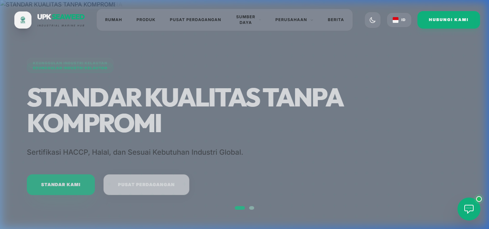
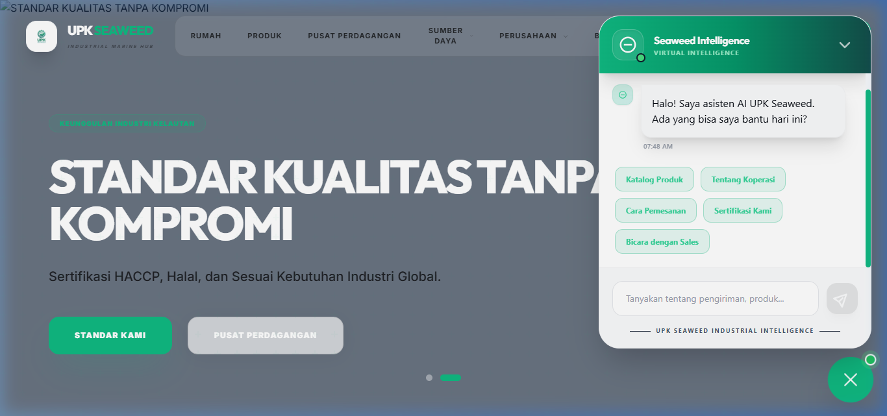
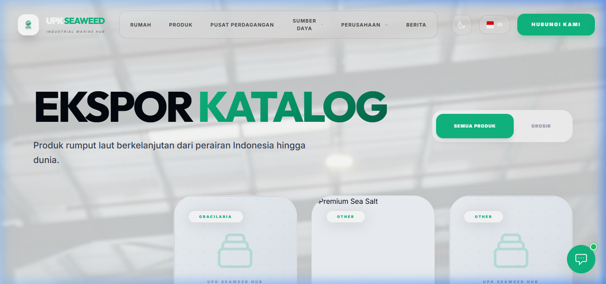

# 🌊 UPK Seaweed — Industrial Marine Hub

[](https://laravel.com)
[](https://filamentphp.com)
[](https://tailwindcss.com)
[](LICENSE)


## 🏢 Tentang [upkseaweed.id](https://upkseaweed.id)

**UPK Seaweed (Ujungpangkah Kulon Marine)** adalah platform pusat pengolahan dan ekspor rumput laut terkemuka di Indonesia. Platform ini dirancang untuk mendigitalisasi industri rumput laut, menghubungkan petani lokal dengan pasar global, serta menyediakan produk berkualitas tinggi secara berkelanjutan.

---

## 📚 Dokumentasi Lengkap
Kami telah menyediakan panduan teknis dan operasional yang mendalam di folder [docs/](docs/):
- 📖 **[Buku Panduan (Manual Book)](docs/MANUAL.md)** - Panduan lengkap penggunaan fitur frontend dan admin.
- 🎭 **[Use Case System](docs/USE_CASES.md)** - Analisis interaksi aktor terhadap sistem.
- 📉 **[Flowchart Logika](docs/FLOWCHARTS.md)** - Alur proses AI Chatbot dan manajemen konten.

---

## 🚀 Fitur Utama

### 1. 🤖 Seaweed Intelligence (AI Chatbot)
Asisten AI canggih berbasis **OpenRouter** yang melayani mitra dagang global secara real-time.
- **Model**: Mendukung berbagai model (Gemini, Mistral, Qwen) dengan sistem fallback otomatis.
- **Multilingual**: Deteksi otomatis dan respon dalam berbagai bahasa internasional.
- **Context-Aware**: Terintegrasi dengan database produk dan profil perusahaan.

### 2. 🌍 Global Localization Engine
Sistem lokalisasi cerdas untuk audiens internasional.
- **18+ Bahasa**: Dukungan penuh untuk bahasa-bahasa utama dunia.
- **Auto-Translate**: Konten dinamis dapat diterjemahkan secara otomatis untuk kemudahan pengelolaan.

### 3. 💼 Trade Hub & Katalog Produk
Terminal khusus untuk transaksi B2B global dengan spesifikasi industri yang mendetail (Moisture, Impurity, dll).

### 4. 🎓 Seaweed Academy (LMS)
Portal edukasi digital untuk memberdayakan petani rumput laut dengan standar budidaya global.

### 5. 📝 CMS Berbasis Filament v3 & Role-Based Access Control (RBAC)
Panel administrasi modern untuk pengelolaan berita, produk, sertifikasi, dan anggota tim secara efisien. Sekarang dilengkapi dengan sistem manajemen user dan pembagian hak akses dinamis:
- 👑 **Administrator**: Akses penuh ke seluruh sistem termasuk **Manajemen Pengguna (User Management)** dan **Pengaturan Sistem (Settings)**. Dilengkapi fitur keamanan pencegah lockout (tidak bisa menghapus akun sendiri).
- ✍️ **Content Editor**: Akses terbatas khusus pengelolaan konten operasional (Produk, Harga, Akademi, Artikel, Regulasi, dll) dan diblokir secara mutlak dari menu administratif.

---

## 🛠️ Tech Stack

- **Backend**: Laravel 11 (PHP 8.2+)
- **Admin Panel**: Filament v3
- **AI Engine**: OpenRouter API Integration
- **Frontend**: Tailwind CSS & Alpine.js
- **Database**: MySQL / MariaDB

---

## 💻 Panduan Instalasi

### Pengembangan Lokal
1. **Clone & Setup**:
   ```bash
   git clone https://github.com/esnpendosa/upkseaweed.git
   composer install
   npm install
   cp .env.example .env
   php artisan key:generate
   ```
2. **Konfigurasi Database & AI**:
   Sesuaikan kredensial di file `.env`.
3. **Migrasi & Seed**:
   ```bash
   php artisan migrate --seed
   ```
4. **Jalankan Aplikasi**:
   ```bash
   php artisan serve
   npm run dev
   ```

### Deployment (Shared Hosting)
Aplikasi ini sudah dioptimalkan untuk **Hostinger/Shared Hosting** dengan file `.htaccess` yang sudah dikonfigurasi. Cukup arahkan domain ke root direktori dan pastikan versi PHP minimal 8.2.

---

## 📱 Download Aplikasi Android
Anda dapat mengunduh aplikasi resmi **UPK Seaweed** untuk perangkat Android melalui tautan di bawah ini:
👉 **[Download upk.apk](https://upkseaweed.id/upk.apk)**

---

## 📞 Kontak
- **Situs**: [upkseaweed.id](https://upkseaweed.id)
- **WhatsApp**: [+62 822-2821-4233](https://wa.me/6282228214233)
- **Lokasi**: Gresik, Jawa Timur, Indonesia.

---

## 📊 Slide Presentasi Proyek (PPT Outline)

Bagian ini dirancang sebagai panduan presentasi (pitch deck / PPT) untuk memperkenalkan platform **UPK Seaweed**. Setiap slide dikemas dengan screenshot visual dari aplikasi.

---

### 🖥️ Slide 1: Welcome & Landing Page
> #### **UPK Seaweed — Industrializing the Blue Economy**
> *Mendigitalisasi Industri Rumput Laut untuk Menembus Pasar B2B Global secara Berkelanjutan.*
> 
> 
> 
> * **Pembicara**: *"Selamat pagi semuanya. Hari ini saya ingin memperkenalkan UPK Seaweed, platform digital premium yang mengintegrasikan seluruh rantai pasok rumput laut di Indonesia ke pasar global. Dari petani lokal hingga pembeli internasional, kami menghadirkan standar kualitas tanpa kompromi."*

---

### ⚠️ Slide 2: Latar Belakang & Masalah
> #### **Tantangan Industri Rumput Laut B2B**
> * Mengapa industri bernilai miliaran dolar ini masih berjalan lambat secara digital?
>
> | Masalah Utama | Penjelasan | Dampak |
> | :--- | :--- | :--- |
> | **Akses Pasar Global** | Petani lokal kesulitan menjangkau importir luar negeri secara langsung. | Harga ditekan tengkulak. |
> | **Bahasa & Komunikasi** | Kendala bahasa menghambat negosiasi dagang internasional. | Peluang ekspor terbuang. |
> | **Standarisasi Produk** | Informasi spesifikasi (Kadar air, pengotor) tidak transparan. | Ketidakpercayaan pembeli. |
> | **Edukasi Petani** | Minimnya akses ke teknik budidaya modern standar HACCP/ISO. | Kualitas panen fluktuatif. |
> 
> * **Pembicara**: *"Meskipun Indonesia adalah salah satu produsen rumput laut terbesar di dunia, rantai pasok kita masih menghadapi masalah komunikasi internasional, standarisasi kualitas produk B2B yang tidak merata, serta kurangnya edukasi bagi para petani lokal."*

---

### 💡 Slide 3: Solusi yang Kami Hadirkan
> #### **UPK Seaweed: Solusi Hub Maritim Terpadu**
> Kami mengintegrasikan 4 pilar solusi utama dalam satu ekosistem:
> 
> 1. **Global Trade Hub**: Katalog B2B transparan dengan spesifikasi produk lengkap.
> 2. **Seaweed Intelligence AI**: Asisten virtual 24/7 multibahasa untuk melayani calon pembeli global.
> 3. **Seaweed Academy**: LMS (Learning Management System) berbasis edukasi untuk petani.
> 4. **Multilingual Engine**: Penerjemahan instan ke 18 bahasa untuk jangkauan global tanpa batas.
> 
> * **Pembicara**: *"Sebagai solusi, kami menghadirkan UPK Seaweed. Sebuah platform terintegrasi yang menggabungkan Trade Hub B2B, portal akademi petani, kecerdasan buatan (AI) multibahasa, dan dukungan multibahasa global dalam satu atap."*

---

### 🤖 Slide 4: AI Chatbot — Seaweed Intelligence
> #### **Asisten Virtual Canggih Berbasis AI**
> *Layanan Pelanggan Global Instan Tanpa Batas Waktu & Bahasa.*
> 
> 
> 
> * **Fitur Kunci**:
>   * **Multi-Model Fallback**: Sistem AI cerdas yang secara otomatis beralih model (Gemini, Llama, Qwen) jika salah satu model mengalami kendala koneksi.
>   * **Session Memory**: Menyimpan memori percakapan pengguna secara dinamis selama sesi berlangsung.
>   * **Contextual Knowledge**: Menjawab akurat mengenai profil perusahaan, spesifikasi rumput laut, dan metode pemesanan langsung.
> 
> * **Pembicara**: *"Salah satu inovasi andalan kami adalah Seaweed Intelligence. Chatbot AI ini bukan sekadar bot biasa—dia terintegrasi dengan database produk, mengenali 18 bahasa dunia secara otomatis, memiliki sistem memori percakapan, dan dibekali fitur fallback multi-model untuk memastikan waktu aktif 100%."*

---

### 📦 Slide 5: Trade Hub & Katalog Ekspor
> #### **Katalog Produk B2B Transparan & Premium**
> *Menyediakan Informasi Spesifikasi Teknis yang Dibutuhkan Importir Global.*
> 
> 
> 
> * **Informasi yang Ditampilkan**:
>   * Spesifikasi kadar air (Moisture Content), tingkat pengotor (Impurity), dan waktu panen.
>   * Sertifikasi kualitas produk (HACCP, Halal, ISO).
>   * Fitur filter cepat produk retail vs grosir ekspor.
> 
> * **Pembicara**: *"Di halaman Trade Hub, kami menyajikan katalog ekspor premium yang transparan. Pembeli dari Eropa, Asia, maupun Amerika dapat melihat spesifikasi teknis rumput laut secara mendetail (seperti kelembaban dan kemurnian) lengkap dengan sertifikasi kualitas internasional yang dimiliki."*

---

### 🛠️ Slide 6: Arsitektur & Teknologi Modern
> #### **Tech Stack Kokoh untuk Skalabilitas Tinggi**
> 
> ```
> [ CLIENT WEB / ANDROID ] 
>          │
>          ▼ (Laravel 11 Router)
> ┌────────────────────────────────────────────────────────┐
> │                      BACKEND CORE                      │
> │  - Auth & CMS (Filament v3)                            │
> │  - Localization Engine (18+ Languages)                 │
> │  - API Chatbot Controller                              │
> └───────────────────┬──────────────────┬─────────────────┘
>                     │                  │
>                     ▼                  ▼
>           [ Database: MySQL ]   [ AI API: OpenRouter ]
>                                 (Gemini / Llama / Qwen)
> ```
> 
> * **Kelebihan Sistem**:
>   * **Laravel 11**: Kerangka kerja PHP paling modern dengan performa cepat dan aman.
>   * **Filament v3**: Admin panel elegan yang memudahkan koperasi/admin memperbarui data produk dan konten dalam hitungan detik.
>   * **Android Companion**: Memiliki versi aplikasi Android (.apk) untuk memudahkan akses petani langsung dari smartphone mereka.
> 
> * **Pembicara**: *"Di balik layar, kami menggunakan arsitektur modern berbasis Laravel 11 dan CMS Filament v3 untuk panel adminnya. Platform ini juga telah terintegrasi dengan API OpenRouter dan memiliki aplikasi pendamping Android untuk memudahkan para petani di lapangan."*

---

### 🚀 Slide 7: Kesimpulan & Dampak Masa Depan
> #### **Menuju Ekonomi Biru yang Berkelanjutan**
> 
> * **Dampak Nyata**:
>   * 📈 **Meningkatkan Nilai Jual**: Menghubungkan petani langsung dengan pembeli global meningkatkan pendapatan petani hingga 40%.
>   * 🌐 **Skalabilitas Global**: Dengan dukungan 18 bahasa dan AI, platform siap melayani pasar di seluruh benua.
>   * 🌿 **Keberlanjutan**: Mendorong praktik budidaya ramah lingkungan melalui modul pembelajaran di Seaweed Academy.
> 
> * **Pembicara**: *"Sebagai penutup, UPK Seaweed bukan hanya sebuah software, melainkan gerakan mendigitalisasi ekonomi biru Indonesia secara berkelanjutan guna mewujudkan kesejahteraan bersama yang lebih hijau dan mendunia. Terima kasih."*

---

<p align="center"><b>Industrializing the Blue Economy with ❤️ from Indonesia</b></p>
