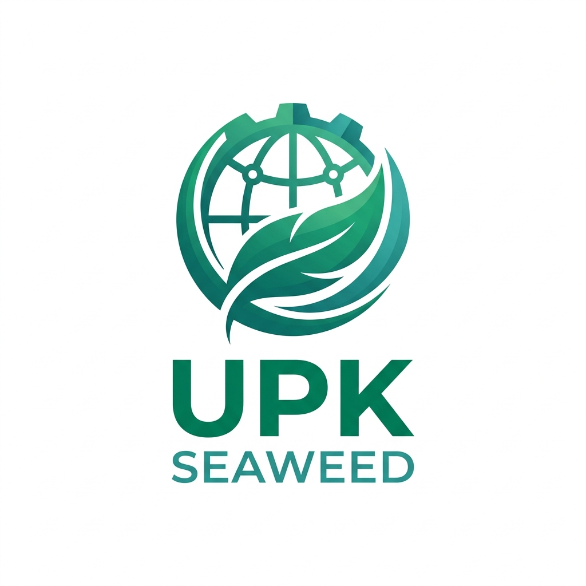

# 🌊 UPK Seaweed — Industrial Marine Hub

[](https://laravel.com)
[](https://filamentphp.com)
[](https://tailwindcss.com)
[](LICENSE)



## 🏢 Tentang [upkseaweed.id](https://upkseaweed.id)

**UPK Seaweed (Ujungpangkah Kulon Marine)** adalah platform pusat pengolahan dan ekspor rumput laut terkemuka di Indonesia. Platform ini dirancang untuk mendigitalisasi industri rumput laut, menghubungkan petani lokal dengan pasar global, serta menyediakan produk berkualitas tinggi secara berkelanjutan.

---

## 📚 Dokumentasi Lengkap
Kami telah menyediakan panduan teknis dan operasional yang mendalam di folder [docs/](docs/):
- 📖 **[Buku Panduan (Manual Book)](docs/MANUAL.md)** - Panduan lengkap penggunaan fitur frontend dan admin.
- 🎭 **[Use Case System](docs/USE_CASES.md)** - Analisis interaksi aktor terhadap sistem.
- 📉 **[Flowchart Logika](docs/FLOWCHARTS.md)** - Alur proses AI Chatbot dan manajemen konten.

---

## 🚀 Fitur Utama

### 1. 🤖 Seaweed Intelligence (AI Chatbot)
Asisten AI canggih berbasis **OpenRouter** yang melayani mitra dagang global secara real-time.
- **Model**: Mendukung berbagai model (Gemini, Mistral, Qwen) dengan sistem fallback otomatis.
- **Multilingual**: Deteksi otomatis dan respon dalam berbagai bahasa internasional.
- **Context-Aware**: Terintegrasi dengan database produk dan profil perusahaan.

### 2. 🌍 Global Localization Engine
Sistem lokalisasi cerdas untuk audiens internasional.
- **18+ Bahasa**: Dukungan penuh untuk bahasa-bahasa utama dunia.
- **Auto-Translate**: Konten dinamis dapat diterjemahkan secara otomatis untuk kemudahan pengelolaan.

### 3. 💼 Trade Hub & Katalog Produk
Terminal khusus untuk transaksi B2B global dengan spesifikasi industri yang mendetail (Moisture, Impurity, dll).

### 4. 🎓 Seaweed Academy (LMS)
Portal edukasi digital untuk memberdayakan petani rumput laut dengan standar budidaya global.

### 5. 📝 CMS Berbasis Filament v3
Panel administrasi modern untuk pengelolaan berita, produk, sertifikasi, dan anggota tim secara efisien.

---

## 🛠️ Tech Stack

- **Backend**: Laravel 11 (PHP 8.2+)
- **Admin Panel**: Filament v3
- **AI Engine**: OpenRouter API Integration
- **Frontend**: Tailwind CSS & Alpine.js
- **Database**: MySQL / MariaDB

---

## 💻 Panduan Instalasi

### Pengembangan Lokal
1. **Clone & Setup**:
   ```bash
   git clone https://github.com/esnpendosa/upkseaweed.git
   composer install
   npm install
   cp .env.example .env
   php artisan key:generate
   ```
2. **Konfigurasi Database & AI**:
   Sesuaikan kredensial di file `.env`.
3. **Migrasi & Seed**:
   ```bash
   php artisan migrate --seed
   ```
4. **Jalankan Aplikasi**:
   ```bash
   php artisan serve
   npm run dev
   ```

### Deployment (Shared Hosting)
Aplikasi ini sudah dioptimalkan untuk **Hostinger/Shared Hosting** dengan file `.htaccess` yang sudah dikonfigurasi. Cukup arahkan domain ke root direktori dan pastikan versi PHP minimal 8.2.

---

## 📱 Download Aplikasi Android
Anda dapat mengunduh aplikasi resmi **UPK Seaweed** untuk perangkat Android melalui tautan di bawah ini:
👉 **[Download upk.apk](https://upkseaweed.id/upk.apk)**

---

## 📞 Kontak
- **Situs**: [upkseaweed.id](https://upkseaweed.id)
- **WhatsApp**: [+62 822-2821-4233](https://wa.me/6282228214233)
- **Lokasi**: Gresik, Jawa Timur, Indonesia.

<p align="center"><b>Industrializing the Blue Economy with ❤️ from Indonesia</b></p>
