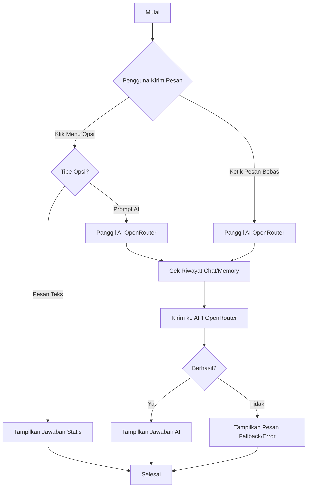
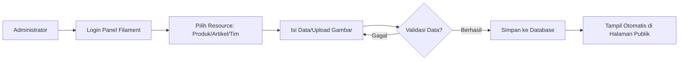
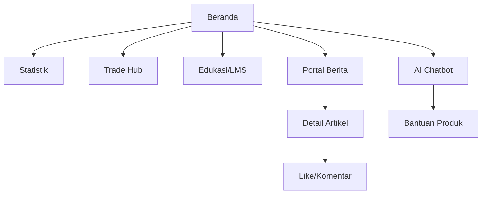

# Flowcharts - UPK Seaweed Industrial Hub

Dokumen ini menjelaskan alur logika sistem dalam menangani interaksi pengguna dan manajemen konten.

## 1. Alur Interaksi AI Chatbot
Alur ini menjelaskan bagaimana pesan pengguna diproses oleh sistem, apakah melalui opsi menu statis atau melalui kecerdasan buatan (Gemini/Mistral).

## 2. Alur Manajemen Konten (Admin)
Alur proses pembuatan hingga publikasi konten oleh administrator.

## 3. Alur Navigasi Pengguna (Frontend)
Bagaimana pengguna berpindah dari satu halaman ke halaman lainnya.

