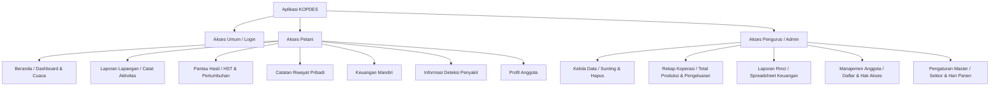

# BUKU PETUNJUK PENGGUNAAN APLIKASI (USER MANUAL)
## APLIKASI MANAJEMEN BUDIDAYA RUMPUT LAUT (KOPDES)
### KOPERASI PRODUSEN KAMPUNG PERIKANAN UJUNGPANGKAH, GRESIK

**Versi 2.1.0**  
**Dinas Komunikasi, Informatika, dan Koperasi Produsen Kampung Perikanan**  
**Tahun 2026**

---

## DAFTAR INFORMASI DOKUMEN

Dokumen ini ditujukan kepada seluruh anggota aktif **Petani Rumput Laut** dan **Pengurus Koperasi Produsen Kampung Perikanan** Desa Pangkahkulon, Kecamatan Ujungpangkah, Kabupaten Gresik.

### © Hak Cipta Koperasi Produsen Kampung Perikanan Ujungpangkah
*Hak cipta dilindungi oleh Undang-Undang.*

Buku Petunjuk Penggunaan Aplikasi ini dimiliki secara penuh oleh Koperasi Produsen Kampung Perikanan Ujungpangkah. Dilarang keras menyalin, memperbanyak, menerbitkan ulang sebagian atau seluruh isi buku ini dengan cara apa pun, baik elektronik maupun mekanis (termasuk fotokopi atau sistem penyimpanan data digital), tanpa didahului persetujuan tertulis dari Pengurus Koperasi Produsen Kampung Perikanan Ujungpangkah.

---

## KATA PENGANTAR

Tidak bisa dimungkiri bahwa saat ini kita tidak dapat lepas dari dunia digital. Teknologi informasi sangat berperan dalam efisiensi tata kelola kehidupan manusia abad ini. Dengan adanya digitalisasi, berbagai sektor usaha dapat terbantu secara signifikan, terutama bagi para pelaku usaha kecil dan menengah serta koperasi yang memiliki tingkat mobilitas tinggi.

Aplikasi berbasis web dan mobile ini dikembangkan sebagai bentuk implementasi tata kelola koperasi yang modern, transparan, dan akuntabel (*Good Cooperative Governance*). Melalui aplikasi **Manajemen Budidaya Rumput Laut (KOPDES)** yang dapat diakses secara lokal maupun menggunakan basis data terintegrasi Firebase, para petani kini dapat mencatat hasil panen harian, melacak penyusutan potongan secara riil, memantau cuaca dan gelombang pasang, mendeteksi penyakit dini, hingga mencatat kas keuangan secara mandiri. Di sisi lain, Pengurus Koperasi dapat langsung melakukan pengawasan stok gudang secara real-time serta menghasilkan laporan rinci dengan rumus akuntansi otomatis yang siap diekspor ke dalam format Excel dan PDF.

Semoga Buku Panduan (*User Manual*) ini dapat memberikan manfaat yang sebesar-besarnya dalam mempermudah operasional harian seluruh anggota dan pengurus demi terwujudnya kemakmuran bersama Kampung Perikanan Ujungpangkah.

Gresik, 19 Mei 2026  
**Ketua Koperasi Produsen Kampung Perikanan Ujungpangkah**  

---

## DAFTAR ISI

*   **BAB I: PENDAHULUAN**
    *   1.1. Tujuan Pembuatan Dokumen
    *   1.2. Deskripsi Umum Sistem
        *   1.2.1. Deskripsi Umum Aplikasi
        *   1.2.2. Kebutuhan Aplikasi Yang Diimplementasikan
    *   1.3. Deskripsi Dokumen (Ikhtisar Bab)
*   **BAB II: SUMBER DAYA YANG DIBUTUHKAN**
    *   2.1. Spesifikasi Perangkat Lunak (*Software*)
    *   2.2. Spesifikasi Perangkat Keras (*Hardware*)
    *   2.3. Kebutuhan Sumber Daya Manusia (*Brainware*)
    *   2.4. Pengenalan dan Pelatihan
*   **BAB III: MENU DAN CARA PENGGUNAAN**
    *   3.1. Struktur Menu Aplikasi
    *   3.2. Tata Cara Penggunaan
        *   3.2.1. Pendaftaran Akun Baru (*Register*)
        *   3.2.2. Masuk ke Aplikasi (*Login*)
        *   3.2.3. Keluar dari Aplikasi & Keamanan Sesi (*Logout*)
        *   3.2.4. Membaca Dashboard & Widget Cuaca Geografis
        *   3.2.5. Mencatat Laporan Lapangan Baru (*Harvest & Sales*)
        *   3.2.6. Memantau Pertumbuhan Rumput Laut (*Growth*)
        *   3.2.7. Mengelola Arus Kas Keuangan (*Finance*)
        *   3.2.8. Membaca Panduan Penyakit (*Diseases*)
        *   3.2.9. Manajemen Data & Riwayat (Khusus Pengurus)
        *   3.2.10. Laporan Rinci & Ekspor Data Excel/PDF (Khusus Pengurus)
        *   3.2.11. Manajemen Anggota Koperasi (Khusus Pengurus)
        *   3.2.12. Manajemen Master Data & Sistem (Khusus Pengurus)
        *   3.2.13. Fitur Pencatatan Laporan Atas Nama Pekerja / Anggota (Khusus Pengurus)
*   **BAB IV: PEMECAHAN MASALAH (TROUBLESHOOTING)**

---

## BAB I: PENDAHULUAN

### 1.1. TUJUAN PEMBUATAN DOKUMEN
Dokumen *User Manual* Aplikasi KOPDES ini dibuat dengan tujuan untuk mempermudah anggota dalam memahami alur kerja, pengoperasian, serta fungsi-fungsi teknis dari setiap fitur yang ada di dalam aplikasi. Dokumen ini menjadi acuan panduan resmi bagi:
1.  **Anggota Petani Rumput Laut**: Sebagai panduan teknis mencatat hasil timbangan harian, memantau HST (Hari Setelah Tanam), melihat prakiraan cuaca, dan mencatat pengeluaran keuangan pribadi.
2.  **Pengurus Koperasi**: Sebagai koordinator lapangan untuk memantau aktivitas seluruh anggota, mengelola data anggota, mengedit kesalahan input data, serta mencetak laporan pertanggungjawaban bulanan.
3.  **Tim Pengembang / Administrator**: Sebagai fasilitator pemeliharaan sistem.

### 1.2. DESKRIPSI UMUM SISTEM
#### 1.2.1. Deskripsi Umum Aplikasi
Aplikasi KOPDES merupakan platform digital berbasis Web (Vite + React) dan Mobile (Capacitor) yang dirancang untuk menggantikan pencatatan manual buku kas dan timbangan kertas rumput laut menjadi digital. Aplikasi ini mempermudah penyampaian informasi mengenai perkembangan budidaya rumput laut kering secara instan dan akurat di perairan Ujungpangkah.

#### 1.2.2. Kebutuhan Aplikasi Yang Diimplementasikan
Aplikasi mengintegrasikan database cloud Firebase Firestore untuk penyimpanan data yang cepat dan andal secara real-time. Aplikasi ini mencakup:
*   Prakiraan cuaca real-time menggunakan koordinat GPS (Open-Meteo & Nominatim).
*   Validasi penutupan stok hulu untuk mencegah pencatatan transaksi yang tidak masuk akal (seperti penjualan melebihi kapasitas stok aktual di gudang).
*   Pencegahan data bernilai negatif (minus) untuk menjaga validitas kalkulasi neraca keuangan koperasi.
*   Modul ekspor dokumen akuntansi resmi (tabel detailed spreadsheet) berformat Microsoft Excel (.xlsx) dan dokumen cetak PDF (.pdf) lengkap dengan verifikasi izin runtime pada sistem operasi Android.

### 1.3. DESKRIPSI DOKUMEN (IKHTISAR)
Dokumen panduan ini berisikan rincian sebagai berikut:
*   **BAB I**: Berisi pendahuluan yang menjelaskan tujuan pembuatan dokumen panduan, deskripsi umum sistem, dan ikhtisar struktur bab.
*   **BAB II**: Berisi sumber daya perangkat keras, perangkat lunak, dan manusia yang diperlukan agar aplikasi dapat berjalan optimal.
*   **BAB III**: Berisi struktur menu terperinci serta langkah-langkah penggunaan lengkap dengan aturan validasi input data.
*   **BAB IV**: Berisi panduan troubleshooting apabila terjadi kendala teknis atau kegagalan sistem.

---

## BAB II: SUMBER DAYA YANG DIBUTUHKAN

### 2.1. SPESIFIKASI PERANGKAT LUNAK (SOFTWARE)
Aplikasi ini berjalan dengan sangat ringan dan fleksibel. Perangkat lunak yang direkomendasikan adalah:
*   **Perangkat Seluler**: Aplikasi terinstal KOPDES (.apk) pada Android 8.0 (Oreo) ke atas, atau browser bawaan (Google Chrome, Samsung Internet, Mozilla Firefox) yang mutakhir.
*   **Perangkat Desktop**: Browser modern (Google Chrome, Microsoft Edge, Opera, Firefox) dengan dukungan JavaScript aktif.

### 2.2. SPESIFIKASI PERANGKAT KERAS (HARDWARE)
Perangkat keras minimal yang dilibatkan dalam operasional sistem ini adalah:
1.  **Smartphone**: RAM minimal 2 GB, memiliki antena GPS aktif untuk widget cuaca otomatis, dan ruang penyimpanan kosong minimal 100 MB.
2.  **Laptop / Komputer PC**: Prosesor Dual Core, RAM 4 GB, resolusi layar minimal 1024x768 piksel untuk kenyamanan melihat Laporan Rinci.
3.  **Koneksi Internet**: Koneksi paket data seluler atau Wi-Fi yang aktif untuk proses sinkronisasi database Firebase.

### 2.3. KEBUTUHAN SUMBER DAYA MANUSIA (BRAINWARE)
Sumber daya manusia yang akan menggunakan aplikasi ini, baik di level Anggota maupun Pengurus, adalah orang-orang yang:
*   Memiliki pemahaman dasar mengenai pengoperasian smartphone Android (mengklik tombol, mengisi form, dan membaca pemberitahuan layar).
*   Memiliki pemahaman dasar tentang timbangan berat (KG) dan penyusutan potongan pada rumput laut kering.

### 2.4. PENGENALAN DAN PELATIHAN
Sebelum menggunakan aplikasi ini untuk keperluan pencatatan transaksi riil koperasi, seluruh perwakilan kelompok tani dan pengurus wajib mengikuti sesi sosialisasi dan pelatihan yang diselenggarakan oleh Pengurus Koperasi Produsen Kampung Perikanan guna menyelaraskan cara pengisian data.

---

## BAB III: MENU DAN CARA PENGGUNAAN

### 3.1. STRUKTUR MENU APLIKASI
Adapun bagan struktur menu utama yang tersedia di dalam Aplikasi KOPDES dibagi berdasarkan hak akses:

---

### 3.2. TATA CARA PENGGUNAAN

#### 3.2.1. Pendaftaran Akun Baru (Register)
Pendaftaran akun dilakukan sekali pada perangkat masing-masing anggota.
1.  Buka aplikasi KOPDES, klik tulisan **"Daftar disini"** di bawah tombol masuk.
2.  Isi kolom **Nama Lengkap** sesuai dengan KTP Anda.
3.  Isi kolom **Username atau No. HP**. Gunakan nama singkat (contoh: `budi123` atau `08123456789`) tanpa menggunakan spasi dan simbol.
4.  Ketik **Password** yang mudah Anda ingat (minimal 6 karakter).
5.  Pilih Peran Anda secara jujur:
    *   Pilih **PETANI** jika Anda adalah anggota pembudidaya tambak.
    *   Pilih **PENGURUS** jika Anda adalah jajaran admin/koordinator koperasi.
6.  Tekan tombol **"DAFTAR SEKARANG"**.

#### 3.2.2. Masuk ke Aplikasi (Login)
1.  Masukkan **Username atau No. HP** yang telah Anda daftarkan sebelumnya.
2.  Masukkan **Password** Anda secara presisi.
3.  Klik **"MASUK SEKARANG"**.
4.  Jika sukses, aplikasi akan menyimpan sesi masuk Anda secara lokal dan mengarahkan Anda ke halaman Beranda.

#### 3.2.3. Keluar dari Aplikasi & Keamanan Sesi (Logout)
Sesi login Anda dirancang untuk terus aktif demi mempermudah akses cepat harian. Namun, jika Anda ingin berganti akun demi keamanan data:
1.  Buka **Bilah Menu Samping** (Drawer) atau masuk ke menu **Profil**.
2.  Klik tombol **"KELUAR / KELUAR AKUN"** yang berwarna merah.
3.  Konfirmasi tindakan Anda dengan mengklik **"Ya"** pada kotak dialog.
4.  Aplikasi akan menghapus data cache penyimpanan lokal (`localStorage` & `sessionStorage`) serta memicu penyegaran halaman penuh (*hard reload*) untuk memastikan tidak ada data akun sebelumnya yang tersangkut.

#### 3.2.4. Membaca Dashboard & Widget Cuaca Geografis
1.  **Dashboard Petani**: Menyajikan sapaan nama Anda, rangkuman berat timbangan hasil panen terakhir Anda, serta total jumlah seluruh entri yang sudah Anda masukkan.
2.  **Dashboard Pengurus**: Menampilkan total data entri dari seluruh anggota koperasi secara kumulatif.
3.  **Widget Prakiraan Cuaca**:
    *   Saat pertama kali dibuka, aplikasi akan meminta izin lokasi GPS. Klik **Izinkan** (Allow).
    *   Aplikasi mendeteksi desa/kecamatan tempat Anda berada dan menyajikan suhu (°C), kondisi langit, serta informasi ramalan tinggi gelombang air laut (m) di Ujungpangkah untuk keselamatan berlayar ke tambak.

*Catatan: Anda juga dapat melihat detail cuaca dan pasang surut air laut yang lengkap pada menu Cuaca seperti di bawah ini:*

#### 3.2.5. Mencatat Laporan Lapangan Baru (Harvest & Sales)
Formulir Laporan Lapangan digunakan untuk mencatat semua aktivitas budidaya seperti panen rumput laut maupun pencatatan transaksi penjualan ke pihak luar.

##### LANGKAH-LANGKAH PENGISIAN FORMULIR:

##### A. Cara Mencatat Hasil Panen / Timbangan Baru (Harvest):
Langkah ini dilakukan untuk mencatat berat hasil timbangan rumput laut basah/kering yang baru masuk dari tambak:
1.  **Buka Formulir**: Tekan tombol bulat berlogo **( + )** berwarna biru di bagian bawah tengah layar Anda. Jendela formulir input akan bergeser naik dari bawah.
2.  **Pilih Tipe Laporan**: Klik opsi **PANEN / HASIL** pada pilihan teratas.
3.  **Pilih Jenis Aktivitas**: Klik kolom pilihan aktivitas, pilih salah satu (misal: *Panen*, *Penimbangan*, atau *Cek Rumput*).
4.  **Pilih Sektor Lahan**: Klik kolom Sektor, pilih kode perairan asal rumput laut Anda (misal: *A1*, *A2*, dst).
5.  **Ketik Nama Personel**:
    *   Ketik nama pemotong/pembudidaya pada kolom **Nama Pekerja**.
    *   Ketik nama penanggung jawab lapangan pada kolom **Nama Pandego**.
6.  **Pilih Kepemilikan Tambak**: Klik tombol **SEWA** jika lahan tersebut milik sewa koperasi, atau klik tombol **MILIK** jika lahan tersebut milik mandiri Anda sendiri.
7.  **Isi Jumlah Karung**: Ketik angka jumlah karung rumput laut pada kolom **Jumlah Sak** (karung).
8.  **Isi Timbangan Berat**: Ketik angka berat timbangan kotor rumput laut Anda pada kolom **Berat (KG)**. *Aturan Validasi: Angka harus lebih dari 0.*
9.  **Isi Potongan Air/Penyusutan**: Ketik angka potongan penyusutan air/lumpur/sampah pada kolom **Potongan (KG)**.
    *   > [!IMPORTANT]
        > **ATURAN VALIDASI MUTLAK**: Nilai potongan **TIDAK BOLEH** lebih besar dari nilai berat panen. Jika dilanggar, aplikasi akan memunculkan peringatan **"Potongan tidak boleh lebih besar dari berat!"** dan menolak penyimpanan. Hal ini menjamin nilai berat bersih (`sisaKg`) tidak akan pernah minus.
10. **Pilih Kondisi Kesehatan**: Pilih tingkat kesehatan rumput laut (*Subur*, *Gejala Ice-Ice*, atau *Terserang Penyakit*).
11. **Simpan Data**: Tekan tombol panjang **"SIMPAN AKTIVITAS"** berwarna biru gelap di bagian paling bawah formulir. Data akan langsung terkirim dan tersimpan di database cloud Firestore.

##### B. Cara Mencatat Transaksi Penjualan Koperasi (Sales):
Langkah ini dilakukan khusus oleh Pengurus Koperasi saat melakukan penjualan stok rumput laut dari gudang ke pembeli:
1.  **Buka Formulir**: Tekan tombol bulat berlogo **( + )** di bagian bawah tengah layar.
2.  **Pilih Tipe Laporan**: Klik opsi **PENJUALAN** pada pilihan teratas.
3.  **Periksa Stok Gudang**: Perhatikan kotak widget **"Stok Gudang Saat Ini"** di bagian atas form. Kotak ini menampilkan jumlah total stok riil yang tersimpan di gudang secara real-time.
4.  **Ketik Volume Penjualan**: Masukkan angka volume rumput laut yang ingin dijual pada kolom **Total Terjual (KG)**.
    *   > [!WARNING]
        > **ATURAN VALIDASI MUTLAK**: Volume penjualan **TIDAK BOLEH** melebihi jumlah stok gudang saat ini. Jika Anda memasukkan angka penjualan yang lebih besar daripada stok riil gudang, sistem akan memblokir transaksi dengan peringatan: **"Gagal menyimpan! Volume penjualan melebihi stok yang ada di gudang."** Hal ini mencegah kebocoran neraca gudang bernilai negatif.
5.  **Ketik Harga Satuan**: Masukkan harga jual per kilogram pada kolom **Harga Jual (Rp/KG)** (misalnya: ketik *7500* tanpa titik dan koma).
6.  **Periksa Total Pendapatan**: Sistem akan secara otomatis menghitung dan menyajikan total perkiraan uang masuk pada baris *Total Estimasi*.
7.  **Catatan Pembeli**: Tulis nama pembeli atau keterangan tambahan pada kolom Catatan (jika ada).
8.  **Simpan Transaksi**: Klik tombol panjang **"SIMPAN TRANSAKSI"** berwarna biru gelap di bagian paling bawah. Penjualan akan mengurangi stok gudang secara otomatis dan tercatat pada kas koperasi.

#### 3.2.6. Memantau Pertumbuhan Rumput Laut (Growth)
Menu **Pantau Hasil** menyajikan statistik pertumbuhan tanaman:
1.  **Kemajuan Hari Tanam (HST)**: Diagram lingkaran menunjukkan persentase jumlah hari penanaman saat ini dibandingkan target panen (standard: 45 hari).
2.  **Rata-rata Berat & Panjang**: Menampilkan angka rata-rata berat bersih rumput laut (KG) dan panjang tanaman (CM) dari seluruh entri.
    *   *Catatan*: Data transaksi penjualan telah disaring agar **tidak ikut terhitung** dalam rata-rata pertumbuhan rumput laut.
3.  **Rekomendasi Pintar**: Menyajikan instruksi pemeliharaan (seperti pengecekan plastik, pembersihan sampah air, atau persiapan penjemuran) secara otomatis berdasarkan rentang usia HST tanaman rumput laut.

#### 3.2.7. Mengelola Arus Kas Keuangan (Finance)
Menu **Keuangan** mempermudah monitoring arus uang masuk dan keluar koperasi agar tidak ada selisih neraca keuangan.

##### LANGKAH-LANGKAH PENCATATAN KEUANGAN:

##### Cara Menginput Transaksi Keuangan Baru:
1.  **Masuk ke Halaman**: Klik menu **Keuangan** dari bilah navigasi atau bilah menu samping.
2.  **Periksa Saldo Aktif**: Di bagian atas halaman, Anda dapat melihat informasi saldo bersih yang tersisa pada widget **"Saldo Kas Bersih"** (Pemasukan dikurangi Pengeluaran).
3.  **Buka Formulir Transaksi**: Klik tombol melayang bulat **( + )** berwarna biru gelap yang terletak di sebelah kanan tengah layar Anda.
4.  **Pilih Tipe Keuangan**: 
    *   Pilih opsi **PEMASUKAN** jika Anda mencatat uang masuk (misal: modal awal, dana hibah, pembayaran piutang).
    *   Pilih opsi **PENGELUARAN** jika Anda mencatat uang keluar (misal: pembelian bibit, solar kapal, perbaikan tali tambak, upah pandego).
5.  **Isi Jumlah Uang**: Ketik nominal uang pada kolom **Nominal (Rp)** (contoh: ketik *150000*). Aplikasi secara otomatis akan memformat titik pemisah ribuan saat Anda mengetik untuk menghindari kesalahan penulisan angka nol. *Aturan Validasi: Nominal uang tidak boleh bernilai negatif.*
6.  **Tulis Deskripsi**: Tulis deskripsi singkat pada kolom **Keterangan** agar pengurus tahu tujuan transaksi tersebut (misal: *Beli Tali Jangkar Sektor A2*).
7.  **Simpan Transaksi**: Klik tombol panjang **"SIMPAN TRANSAKSI"** di bagian bawah form. Kas bersih akan langsung diperbarui secara otomatis.

#### 3.2.8. Membaca Panduan Penyakit (Diseases)
Menu **Penyakit** menyajikan pustaka digital penanganan kesehatan rumput laut:
1.  Pilih jenis penyakit pada daftar (misal: *Ice-Ice*).
2.  Baca kolom **Gejala** untuk mengidentifikasi kondisi di lapangan.
3.  Terapkan **Langkah Pencegahan** dan **Metode Pengobatan** untuk menyelamatkan kualitas bentangan rumput laut Anda.

#### 3.2.9. Manajemen Data & Riwayat (Khusus Pengurus)
Menu **Kelola Data** memberikan kendali penuh bagi Pengurus untuk memantau seluruh riwayat aktivitas, memperbaiki kesalahan input data dari petani, serta menghapus data transaksi yang keliru.

##### LANGKAH-LANGKAH OPERASIONAL:

##### A. Cara Mengubah Data Catatan Timbangan (Edit):
Jika ada petani yang salah memasukkan berat panen, panjang tanaman, atau pilihan sektor, Pengurus dapat memperbaikinya dengan langkah berikut:
1.  **Cari Catatan**: Buka menu **Kelola Data**. Gunakan kotak pencarian di bagian atas atau klik filter Sektor untuk menemukan baris data yang ingin diubah.
2.  **Klik Tombol Sunting**: Temukan baris data petani tersebut, lalu klik tombol **Edit** berlambang **Ikon Pensil** berwarna biru/kuning di sebelah kanan baris data. Jendela popup modal ubah data akan muncul.
3.  **Ubah Nilai Data**: Pada jendela popup tersebut, Pengurus dapat menyesuaikan kolom:
    *   **Sektor**: Pilih sektor perairan yang benar.
    *   **Berat (KG)**: Ketik angka berat timbangan yang benar. *Aturan Validasi: Berat tidak boleh bernilai negatif.*
    *   **Panjang (CM)**: Ketik angka ukuran panjang rumput laut yang benar. *Aturan Validasi: Panjang tidak boleh bernilai negatif.*
    *   **Tingkat Kesehatan**: Pilih kondisi kesehatan tanaman yang sesuai.
    *   **Catatan**: Tulis catatan tambahan atau alasan pengeditan (misal: *Koreksi salah input dari Petani Budi*).
4.  **Simpan Perubahan**: Klik tombol **"Simpan Perubahan"** berwarna biru di bagian bawah popup. Data di database akan diperbarui secara real-time.

##### B. Cara Menghapus Data Catatan Secara Permanen (Delete):
Jika ada data ganda atau data yang terbukti fiktif dan salah input total:
1.  **Cari Catatan**: Buka menu **Kelola Data** dan temukan baris catatan timbangan/panen yang ingin dihapus.
2.  **Klik Tombol Hapus**: Klik tombol **Hapus** berlambang **Ikon Tong Sampah** berwarna merah di sebelah kanan baris data yang dipilih.
3.  **Konfirmasi Penghapusan**: Aplikasi akan memunculkan kotak dialog konfirmasi sistem: *"Hapus log ini secara permanen?"*.
4.  **Setujui Penghapusan**: Klik tombol **"Ya"** atau **"Ok"** pada kotak dialog tersebut. Baris data akan terhapus secara permanen dari database cloud Firestore dan tidak dapat dikembalikan.

#### 3.2.10. Laporan Rinci & Ekspor Data Excel/PDF (Khusus Pengurus)
Halaman **Laporan Rinci** menyajikan lembar kerja terintegrasi yang memetakan aktivitas harian tambak sewa, petani, biaya upah pekerja, persentase pandego (5%), riwayat penjualan, hingga sisa stok gudang aktif.

##### Cara Ekspor ke Microsoft Excel (.xlsx):
1.  Di sudut kanan atas halaman Laporan Rinci, klik tombol hijau bertuliskan **"EKSPOR EXCEL"**.
2.  Sistem secara otomatis mengonversi data tabel menjadi sheet Excel terformat rapi lengkap dengan border, header berkolom ganda (*merges*), serta kalkulasi matematis otomatis.
3.  **Android Permission**:
    *   Aplikasi akan memunculkan popup permohonan izin runtime OS Android: **"Izinkan KOPDES mengakses foto, media, dan berkas di perangkat Anda?"**.
    *   > [!IMPORTANT]
        > Anda **WAJIB** menekan opsi **"IZINKAN"** (Allow). Jika Anda menolak, sistem tidak diizinkan menulis berkas dan proses ekspor akan dibatalkan dengan aman.
4.  Berkas Excel akan tersimpan langsung di folder **Penyimpanan Internal / Documents** di handphone Anda.

##### Cara Ekspor ke Dokumen PDF (.pdf):
1.  Di sudut kanan atas, klik tombol biru bertuliskan **"EKSPOR PDF"**.
2.  Sistem menghasilkan lembar dokumen berorientasi lanskap (Landscape A2) dengan kop resmi Koperasi Kampung Perikanan lengkap dengan logo instansi yang siap dicetak.
3.  Berkas PDF secara otomatis tersimpan di folder **Penyimpanan Internal / Documents** handphone Anda setelah izin storage disetujui.

#### 3.2.11. Manajemen Anggota Koperasi (Khusus Pengurus)
Menu **Manajemen Anggota** memberikan kendali bagi Pengurus untuk mengelola keanggotaan koperasi, mendaftarkan akun petani baru agar bisa login, serta menonaktifkan akun yang sudah tidak aktif.

##### LANGKAH-LANGKAH OPERASIONAL:

##### A. Cara Mendaftarkan Akun Anggota Baru:
Untuk mendaftarkan petani baru agar mereka memiliki akun login di HP masing-masing:
1.  **Masuk ke Halaman**: Klik menu **Manajemen Anggota** dari bilah menu samping.
2.  **Buka Formulir Registrasi**: Klik tombol melayang bulat **( + )** bergambar ikon tambah pengguna berwarna biru gelap di sudut kanan bawah layar Anda.
3.  **Isi Data Anggota Baru**:
    *   **Nama Lengkap**: Ketik nama lengkap petani sesuai KTP (contoh: *Budi Santoso*).
    *   **Username / No. HP**: Ketik nama singkat unik tanpa spasi atau nomor HP aktif (contoh: *budi123* atau *08123456789*). Username inilah yang akan digunakan petani untuk login.
    *   **Password Sementara**: Masukkan kata sandi sementara minimal 6 karakter (contoh: *123456*). Berikan sandi ini ke petani bersangkutan agar dapat login pertama kali.
    *   **Pilih Peran**: Klik tombol **Petani** jika pendaftar adalah pembudidaya tambak, atau klik tombol **Pengurus** jika pendaftar adalah koordinator/admin koperasi.
4.  **Daftarkan Akun**: Klik tombol panjang **"DAFTARKAN SEKARANG"** di bagian paling bawah. Akun langsung aktif secara real-time dan terdaftar di database Firestore.

##### B. Cara Menghapus Akun Anggota (Delete Member):
Jika ada anggota yang mengundurkan diri dari keanggotaan koperasi:
1.  **Cari Anggota**: Masuk ke menu **Manajemen Anggota** dan cari nama anggota yang bersangkutan.
2.  **Klik Tombol Hapus**: Klik tombol **Hapus** berlambang **Ikon Tong Sampah** berwarna merah di sebelah kanan nama anggota.
3.  **Konfirmasi Penghapusan**: Jendela konfirmasi akan muncul pada layar: *"Hapus [Nama Anggota] dari koperasi?"*.
4.  **Setujui Penghapusan**: Klik tombol **"Ya"** atau **"Ok"** pada kotak dialog. Akun anggota tersebut akan dihapus secara permanen dari database sistem koperasi.

#### 3.2.12. Manajemen Master Data & Sistem (Khusus Pengurus)
Pada menu **Pengaturan**, Pengurus dapat menyesuaikan konfigurasi dasar sistem:
1.  **Standard Hari Budidaya (HST)**: Mengubah angka batas target hari panen harian (misal: *45 hari*).
2.  **Harga Default per KG**: Mengonfigurasi acuan harga beli koperasi dari petani (misal: *Rp 5.000*).
3.  **Daftar Sektor Aktif**: Menambah kode sektor baru atau menghapus sektor perairan yang sudah tidak produktif.
4.  **Daftar Aktivitas**: Mengelola jenis pilihan daftar aktivitas harian yang tampil di formulir pencatatan petani.

#### 3.2.13. Fitur Pencatatan Laporan Atas Nama Pekerja / Anggota (Khusus Pengurus)
Fitur eksklusif ini dirancang untuk memudahkan Pengurus Koperasi melakukan pencatatan hasil panen lapangan secara kolektif tanpa perlu keluar-masuk (logout-login) akun masing-masing petani. Pengurus dapat mencatat timbangan panen atas nama siapa saja hanya dengan memilih nama dari daftar anggota terdaftar di formulir input.

##### LANGKAH-LANGKAH OPERASIONAL:
1.  **Buka Laporan Lapangan**: Dari Dashboard utama, klik tombol melayang bulat **( + )** di bagian tengah bawah layar untuk membuka halaman input data.
2.  **Pilih Nama Pekerja/Anggota**: Pada bagian paling atas halaman, Anda akan melihat panel bertuliskan **"Catat Atas Nama Anggota / Pekerja"** (hanya muncul jika Anda login sebagai Pengurus). Klik kolom dropdown tersebut dan pilih nama anggota petani yang bersangkutan.
3.  **Isi Data Laporan**: 
    *   Pilih petak tambak perairan (**Sektor**).
    *   Masukkan total berat panen (**KG**) dan jumlah **sak**.
    *   Isi nama **Pandego** (koordinator pengawas tambak).
    *   Masukkan jumlah **potongan berat (KG)** jika ada, serta pilih tipe tambak (**Sewa** atau **Petani**).
4.  **Simpan Laporan**: Klik tombol hitam **"Simpan Laporan"** di paling bawah.
5.  **Verifikasi Pencatatan**: Data panen akan langsung terikat ke akun anggota yang dipilih. Laporan ini otomatis tercatat di menu **Laporan Excel Koperasi** dengan nama petani yang Anda pilih secara real-time dan teratur tanpa ada data yang tertinggal atau minus!

---

## BAB IV: PEMECAHAN MASALAH (TROUBLESHOOTING)

### 1. Masalah: Mengapa Stok Gudang Menunjukkan Angka Negatif (Minus)?
*   **Penyebab**: Terjadi kesalahan input volume penjualan di masa lalu yang melebihi jumlah total hasil panen bersih yang masuk pada tanggal tersebut.
*   **Solusi**: Pengurus harus memeriksa riwayat catatan lama pada menu **Kelola Data**, temukan entri penjualan yang salah isi, lalu edit volume penjualan tersebut atau hapus agar neraca stok gudang kembali seimbang dan positif.

### 2. Masalah: Tombol Ekspor Ditekan tetapi File Excel/PDF Tidak Muncul?
*   **Penyebab**: Izin penyimpanan eksternal diblokir oleh sistem operasi Android atau memori internal Anda penuh.
*   **Solusi**:
    1.  Buka menu **Pengaturan Handphone (Settings)**.
    2.  Masuk ke **Aplikasi / Kelola Aplikasi (Apps)** > pilih aplikasi **KOPDES**.
    3.  Masuk ke **Izin / Permissions** > centang atau aktifkan izin **Penyimpanan / File & Media** ke status **Izinkan / Allow**.
    4.  Buka File Manager di handphone Anda, masuk ke **Penyimpanan Internal > Documents**. Cari berkas dengan nama `Laporan_Kopdes.xlsx` atau `Laporan_Detailed.pdf`.

### 3. Masalah: Prakiraan Cuaca Selalu Menampilkan "Mendeteksi..." atau Lokasi Gresik Default?
*   **Penyebab**: Sensor GPS handphone Anda tidak aktif atau aplikasi tidak diberi izin mengakses lokasi.
*   **Solusi**: Tarik bilah notifikasi handphone Anda ke bawah, pastikan ikon **Lokasi/GPS** telah aktif. Buka kembali aplikasi dan pastikan mengklik "Izinkan Lokasi" ketika aplikasi memintanya.

### 4. Masalah: Aplikasi Lambat atau Data Tidak Sinkron Setelah Pengguna Lain Mengedit?
*   **Penyebab**: Cache memori browser handphone Anda terlalu menumpuk, atau koneksi internet tidak stabil.
*   **Solusi**: Masuk ke menu **Profil** atau bilah samping, klik tombol **KELUAR AKUN** secara resmi. Tindakan keluar resmi akan mereset cache SPA secara bersih dan mengamankan integritas data database. Setelah itu silakan login kembali.

---
*Koperasi Produsen Kampung Perikanan Ujungpangkah - Berkarya Nyata, Sejahtera Bersama.*
